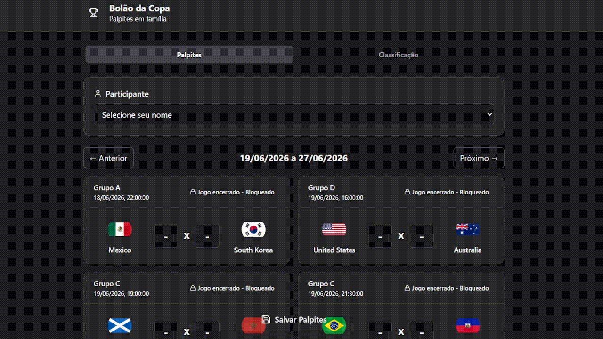

# PALPITE-FAMILY
Projeto pessoal estruturado e desenvolvido para um evento familiar, com o objetivo de proporcionar uma plataforma simples, segura, altamente intuitiva e responsiva para palpites e classificação da Copa do Mundo 2026.

Codificado com Node.js e Express no back-end, integrado diretamente ao MongoDB (driver oficial) — sem o uso de ORMs ou ODMs como o Mongoose. O front-end foi desenvolvido em React utilizando o Vite para uma inicialização e build de alta performance.

## Preview



## Versão mobile


## Tecnologias
-Node.js
-Express
-MongoDB (driver oficial)
-React
-Vite
-CSS (nativo)

## Como executar o projeto

### 1. Repositório

Clone o repositório do projeto e acesse o diretório local para iniciar a configuração:

```bash
git clone https://github.com/mvcostajulia/palpite-family.git
cd projeto-palpite-family
```

### 2. Dependências

1. Acesse a pasta do **backend** e instale as dependências da API:
   ```bash
   cd backend
   npm install
   ```

2. Acesse a pasta do **frontend**, instale as dependências e gere o build de produção:
   ```bash
   cd ../frontend
   npm install
   npm run build
   ```

### 3. Configuração do banco de dados

Este projeto utiliza MongoDB Atlas e requer algumas configurações para ser executado corretamente:

- Criar um cluster no MongoDB Atlas 
- Criar um usuário de banco de dados
- Liberar acesso de IP (IP local ou 0.0.0.0/0)
- Obter a string de conexão 

### 4. Variáveis de ambiente

Para o correto funcionamento da aplicação, é necessário definir as variáveis de ambiente responsáveis pela conexão com o banco de dados e pela autenticação de serviços externos.

1. Crie um arquivo `.env` na raiz da pasta `backend/`.
2. Adicione as seguintes chaves com as suas respectivas credenciais:

```env
# URL de conexão com o cluster do MongoDB Atlas
MONGODB_URI=sua_string_de_conexao_mongodb

# Token de autenticação da API de futebol externa
FOOTBALL_API_TOKEN=seu_token_da_football_data_api
```

> 💡 **Nota:** O token para a variável `FOOTBALL_API_TOKEN` pode ser obtido gratuitamente ao criar uma conta no site oficial do [football-data.org](https://www.football-data.org/).

### 5. Carga Inicial de Participantes (Seed)

Para iniciar o bolão com os membros da família já cadastrados, certifique-se de incluir a lista oficial de participantes no arquivo **participantes.js** na raiz do projeto:

```javascript
const participantes = [
      { id: 1, nome: "Alexandra" },
      { id: 2, nome: "Ana" },
      { id: 3, nome: "João" },
      { id: 4, nome: "Maria" },
      { id: 5, nome: "Pedro" }
];
```

### 6. Execução

Após a configuração do ambiente, execute o projeto no backend com:

```
node server.js
```

A aplicação estará disponível em ambiente local no endereço:

http://localhost:8080

### 7. Funcionalidades

-  Cadastro de palpites semanais para os participantes
-  Bloqueio de jogos iniciados ou finalizados
-  Atualização semanal de jogos
-  Visualização da classificação geral, com pontuação personalizada

### 8. Estrutura do projeto

```
.
├── participantes.js
├── backend/
│   ├── database/
│   │   ├── db.js
│   │   └── db_palpites.js
│   ├── node_modules/
│   ├── .env
│   ├── server.js
│   ├── package-lock.json
│   └── package.json
├── frontend/
│   ├── dist/
│   │   ├── assets/
│   │   └── index.html
│   ├── node_modules/
│   ├── public/
│   ├── src/
│   │   ├── assets/
│   │   ├── App.css
│   │   ├── App.jsx
│   │   ├── index.css
│   │   └── main.jsx
│   ├── .gitignore
│   ├── eslint.config.js
│   ├── index.html
│   ├── package-lock.json
│   ├── package.json
│   ├── postcss.config.js
│   ├── vite.config.js
└── README.md
```

### 9. Considerações técnicas

- Utilização do driver oficial do MongoDB, sem uso de ORMs/ODMs, garantindo controle direto sobre as operações de banco  
- Estrutura modular com separação de responsabilidades entre conexão, rotas e regras de negócio    
- Organização do código voltada à clareza, manutenção e evolução da aplicação  
- Design voltado à usabilidade e intuitividade do sistema

### 10. Considerações finais

Este projeto foi desenvolvido com foco em demanda pessoal e treinamento de habilidades básicas.
